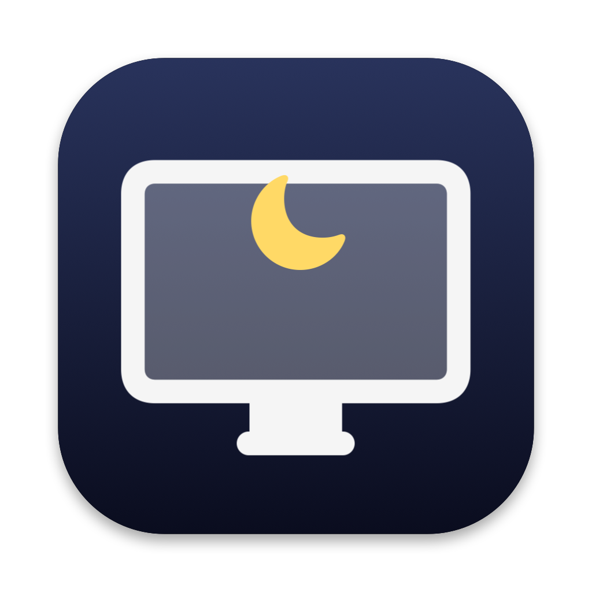

# 关屏不待机 (ScreenOff)

<p align="center"></p>

macOS 菜单栏小工具，两件事：

1. **关屏不待机**：一键把屏幕关掉，电脑照常运行（下载、编译、远程任务不中断）。只有**键盘任意键**能唤醒，鼠标动、点、滚一律忽略，不怕桌上的鼠标被碰到。
2. **全部状态栏**：刘海屏 / 图标太多时，菜单栏放不下的图标会被系统直接藏掉。点一下网格图标，弹出面板列出所有 app 的状态栏项，点哪个就等于点了那个图标。免费替代 Bartender 的这一个功能。

无第三方依赖，一个 Swift 文件，`swiftc` 直接编译。

## 安装

需要 Xcode 或 Command Line Tools（提供 `swiftc`）。

```bash
git clone https://github.com/oncet886/ScreenOff.git
cd ScreenOff
./install.sh
```

装好后菜单栏右侧会出现两个图标（在「控制中心」左边）：

| 图标 | 左键 | 右键 |
|---|---|---|
| 🖥 显示器 | 立即关屏 | 菜单 |
| ▦ 网格 | 弹出全部状态栏面板 | 菜单 |

也可以直接下载 Release 里的 `.app`，拖进「应用程序」。首次打开如果提示「无法验证开发者」，右键 → 打开。

## 使用

- **关屏**：点显示器图标，或全局快捷键 `⌘⇧L`，或在 Dock / 聚焦搜索里再打开一次本 app。按键盘任意键（包括 Shift）亮回来。
- **全部状态栏面板**：第一次点网格图标会要求「辅助功能」权限（系统设置 → 隐私与安全性 → 辅助功能 → 打开「关屏不待机」）。面板里亮色的是当前被挤出菜单栏的，暗色的是本来就能看见的。
- **始终不待机**：右键菜单里勾上，屏幕亮着也不睡。
- **开机自动启动**：右键菜单里勾上，会写一个 LaunchAgent，不需要密码，开机后静默驻留。

## 原理

- 关屏不走系统的显示器休眠（那样鼠标一碰就亮），而是：全屏黑色窗口盖住所有屏幕 + 背光亮度降到 0（`DisplayServices` 私有 API，取不到就只靠黑窗） + `IOPMAssertion` 声明「不待机、不让显示器休眠」。黑窗只响应键盘事件。唤醒后恢复亮度并撤销声明。
- 状态栏面板用 Accessibility API：枚举每个 app 的 `AXExtrasMenuBar` 子项，点击时对该项执行 `AXPress`，与它在不在屏幕内无关。菜单会弹在该项的正下方（刘海下方是可见区域）。
- 本 app 自己的两个图标用 `NSStatusItem Preferred Position` 固定在第三方图标最右侧，菜单栏再满也不会被挤掉。

## 已知限制

- Google Chrome 的状态栏图标不响应 `AXPress`（它只认真实鼠标点击），在面板里点它没有反应。
- 背光归零用的是私有 API，未来系统版本可能失效，届时只剩黑窗遮挡（屏幕仍会有微弱背光）。
- 仅在 macOS 15 / Apple Silicon 上测试过。

## 签名

`build.sh` 默认临时签名。「辅助功能」授权与签名绑定，临时签名每次重编译都要重新授权；有 Apple Development 证书的话：

```bash
CODESIGN_IDENTITY="Apple Development: you@example.com (TEAMID)" ./install.sh
```

## 调试

```bash
关屏不待机.app/Contents/MacOS/ScreenOff --scan            # 列出枚举到的所有状态栏项
关屏不待机.app/Contents/MacOS/ScreenOff --press "App名"   # 按某一项并打印它弹出的窗口位置
```

## License

MIT
